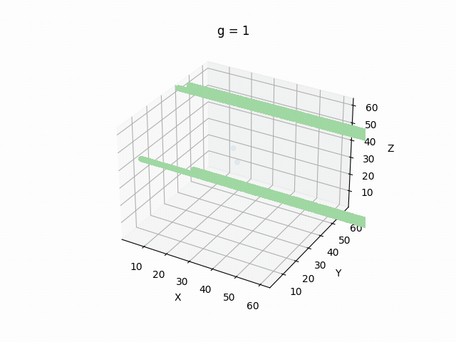
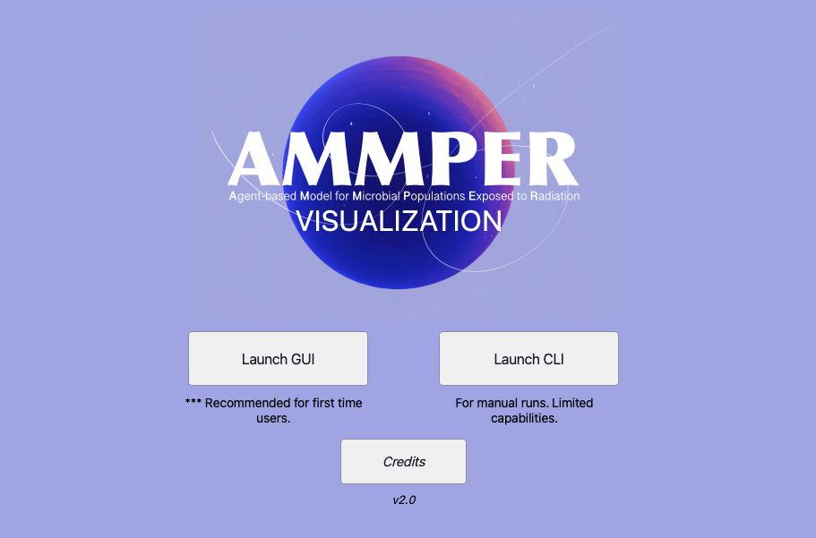
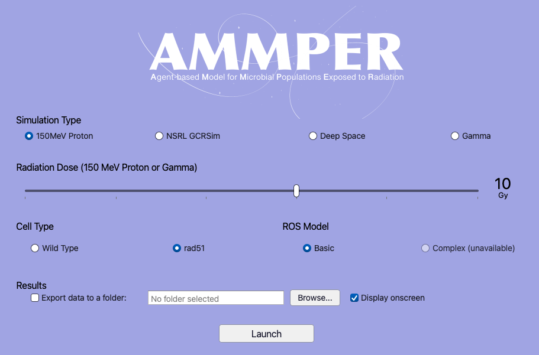
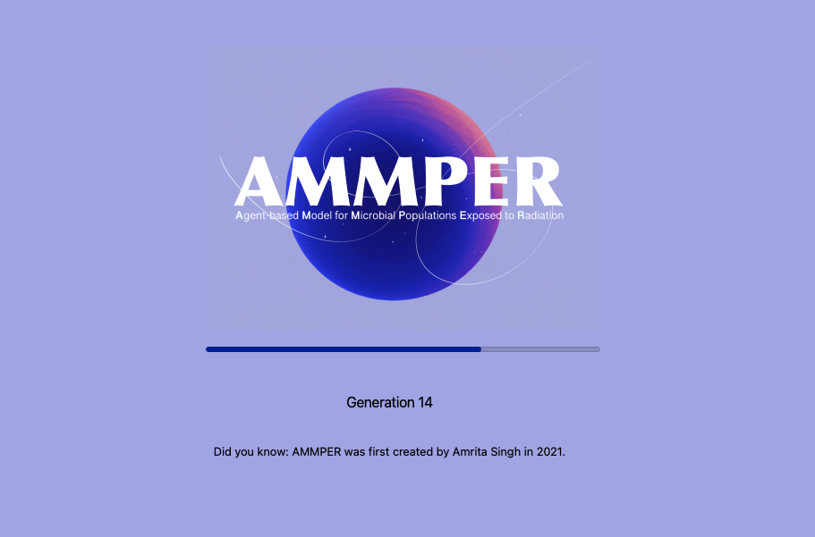
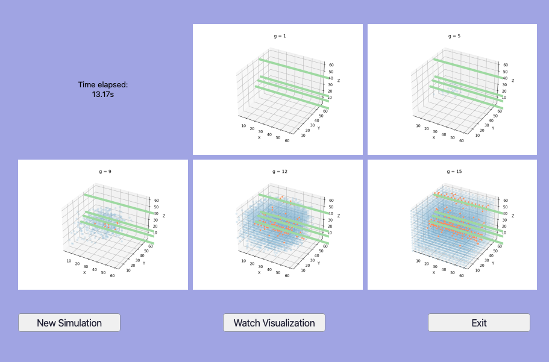
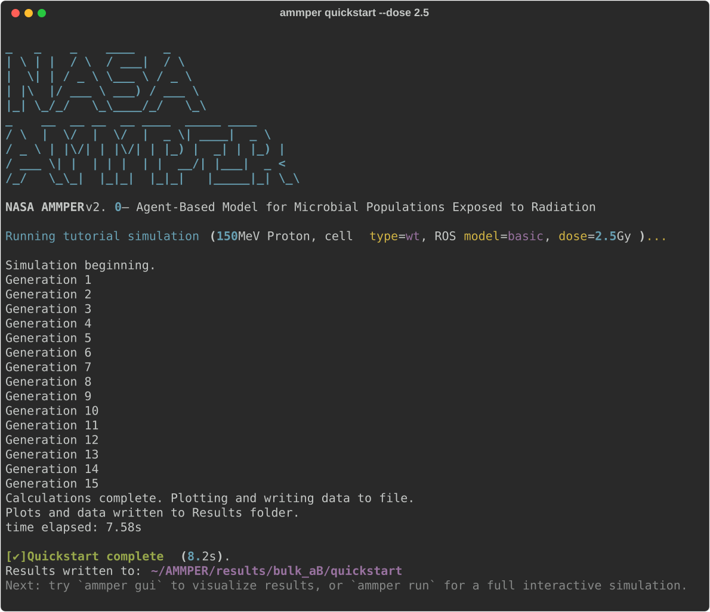
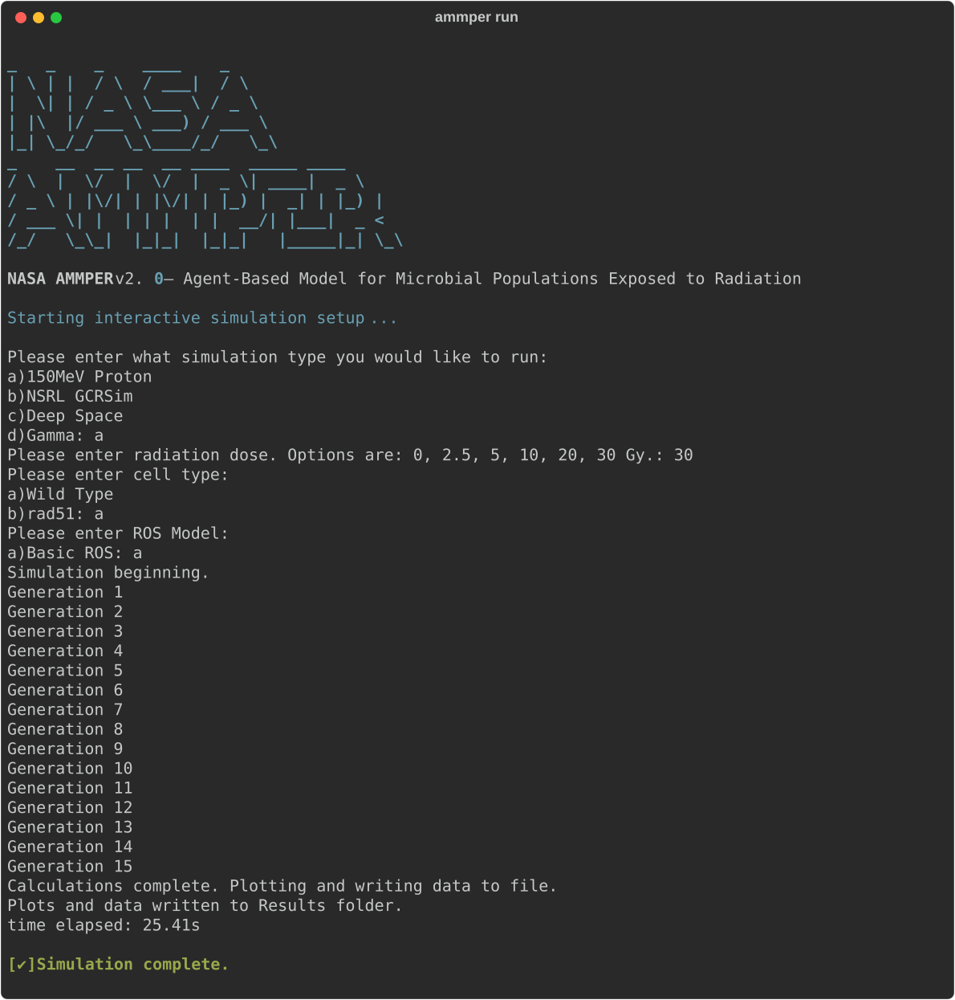

# AMMPER

<p align="center">
  
</p>

<p align="center">
  
  
  <a href="LICENSE"></a>
  
</p>

**AMMPER** (Agent-based Model for Microbial Populations Exposed to Radiation)
simulates how ionizing radiation affects a growing population of yeast
(*Saccharomyces cerevisiae*). Every cell is an individual agent on a 3D
lattice that moves, divides, takes direct radiation damage and damage from
reactive oxygen species (ROS), and repairs DNA. It models the two strains
flown on NASA's BioSentinel mission (wild type and the radiation-sensitive
*rad51*Δ mutant) under 150 MeV proton, gamma, NSRL GCRSim, and deep-space
radiation, and you can drive it from a command line or a desktop GUI.

> [!NOTE]
> AMMPER is research software. It's meant for studying radiation biology and
> for teaching. Don't use it for clinical or operational radiation-risk
> decisions.

<p align="center">
  
  <br/>
  <em>A <i>rad51</i>Δ colony growing over 15 generations after 10 Gy of 150 MeV protons<br/>
  Blue circles: healthy cells · orange stars: dead · green: radiation energy deposits.</em>
</p>

## Table of Contents

- [Quick start](#quick-start)
- [Features](#features)
- [Screenshots](#screenshots)
  - [Desktop GUI](#desktop-gui)
  - [Command line](#command-line)
- [Running scripts directly](#running-scripts-directly)
- [Project layout](#project-layout)

- [Citing AMMPER](#citing-ammper)
- [Contributing](#contributing)
- [License](#license)
- [Credits](#credits)

## Quick start

> [!IMPORTANT]
> AMMPER needs **Python 3.9, 3.10, or 3.11** ([python.org/downloads](https://www.python.org/downloads/)).
> Check with `python3 --version` (macOS/Linux) or `py --version` (Windows).
> On Windows with several versions installed, use `py -3.11` in place of
> `python3` below, e.g. `py -3.11 -m venv venv`.

From a clone of this repository:

```bash
python3 -m venv venv
source venv/bin/activate          # Windows: venv\Scripts\activate
pip install --upgrade pip setuptools wheel
pip install -e .
```

That installs the `ammper` command:

| Command | What it does |
|---|---|
| `ammper setup` | Checks that dependencies and data are in place |
| `ammper quickstart` | Runs a short tutorial simulation (a few seconds), no questions asked |
| `ammper run` | Runs a full simulation, asking you for radiation type, dose, cell type, and ROS model |
| `ammper gui` | Opens the desktop GUI |
| `ammper` | With no arguments, opens a guided menu that picks one of the above |
| `ammper --help` | Everything above, plus options |

Start with `ammper setup`, then `ammper quickstart`. The tutorial saves its
output to `results/bulk_aB/quickstart/` and prints the exact path when it
finishes.

> [!TIP]
> Run `ammper run` and `ammper gui` from the repository folder. Both save
> results to a `Results/` folder relative to where you launch them, and the
> GUI loads its images the same way.

## Features

- **Agent-based**: each yeast cell is simulated individually. It moves by
  Brownian motion, divides, takes damage, and repairs.
- **Two strains**: wild type and *rad51*Δ, the two strains flown on BioSentinel.
- **Four radiation environments** built from RITRACKS radiation-track data:

  | Radiation type | Dose setting | When radiation is applied |
  |---|---|---|
  | **150 MeV Proton** | 0, 2.5, 5, 10, 20, or 30 Gy | Once, at generation 2 |
  | **Gamma** | Any dose above 0, up to 30 Gy | Once (at generation 10 or 2, depending on the tool) |
  | **NSRL GCRSim** | Fixed mixed-energy proton field | Once, at generation 2 |
  | **Deep Space** | Fixed 0.1-month proton exposure | Spread across generations 1–14 |

- **Direct and indirect damage**: single- and double-strand DNA breaks from
  radiation tracks, plus damage from reactive oxygen species.
- **Command line and desktop GUI**: script it, or point and click.
- **Reproducible output**: each run saves a 3D plot per generation and a
  `simDescription.txt` recording its settings (including dose). The
  command-line tools also save every cell's position and health for each
  generation. In the GUI, tick **Export data to a folder** to save that
  file too.
- **Analysis pipeline**: alamarBlue kinetics fitting and the scripts behind
  the published figures (`analysis/`, `revisions_2026/`).

## Screenshots

### Desktop GUI

<p align="center">
  
  <br/>
  <em>Main menu</em>
</p>

<p align="center">
  
  <br/>
  <em>Simulation setup</em>
</p>

<p align="center">
  
  <br/>
  <em>Simulation running</em>
</p>

<p align="center">
  
  <br/>
  <em>Results: the colony at generations 1, 5, 9, 12 and 15</em>
</p>

### Command line

<p align="center">
  
  <br/>
  <em><code>ammper quickstart</code>: a tutorial run, no prompts</em>
</p>

<p align="center">
  
  <br/>
  <em><code>ammper run</code>: an interactive simulation</em>
</p>

## Running scripts directly

The `ammper` command is all you need for single simulations. For batches of
runs, or to rebuild figures, you can call the scripts directly. They find
their own paths, so they work from any folder.

```bash
# One simulation: radType cellType ROSType dose outputFolder
#   radType   a = 150 MeV Proton   b = GCRSim   c = Deep Space   d = Gamma
#   cellType  a = wild type        b = rad51
#   ROSType   a = Basic
#   dose      Proton: 0, 2.5, 5, 10, 20, 30 · Gamma: >0 to 30 · others: any placeholder
python3 -m ammper.AMMPERBulk_aB a a a 2.5 WT_Basic_25
```

Output goes to `results/bulk_aB/<outputFolder>/`. Use the single-letter
codes; spelled-out names like `"150 MeV Proton"` won't work.

Figures:

```bash
python3 analysis/growth_curves/stack_growth_curves.py   # main text Figure 1
python3 analysis/aB/ab_final_plots_panel.py             # main text Figure 2 (panels)
python3 analysis/aB/stack_ab_figures.py                 # main text Figure 2 (stack)
```

In your own scripts, resolve paths through
`ammper_paths` instead of hardcoding them:

```python
import ammper_paths as P
df = pd.read_csv(P.ab_experimental("AlamarblueRawdataWTKGy.csv"))
sim = P.bulk_aB("WT_Basic_0")
out = P.figures("my_panel.png")    # creates figures/ if needed
```

(Code inside `src/ammper/` uses `from ammper import paths as P`; see
`CONTRIBUTING.md`.)

## Project layout

```
src/ammper/            the simulation (installed as the `ammper` package)
  cli.py                 the `ammper` command
  AMMPERCLI.py           interactive simulation (`ammper run`)
  AMMPERBulk_aB.py       non-interactive runner (quickstart, scripts, batches)
  cellDefinition.py      the Cell agent: movement, division, damage, repair
  genTraverse_*.py       radiation tracks (ground-test and deep-space)
  genROSOld.py           ROS model (Basic)
  GammaRadGen.py         gamma radiation events
  cellPlot*.py           per-generation 3D plots
  paths.py               path resolution
gui/                   desktop GUI (PyQt5), fonts, and images
data/
  radiation_input/       RITRACKS track data, by proton energy
  fluence/               GCRSim and deep-space fluence tables
  experimental/          alamarBlue and BioSentinel measurements
analysis/              alamarBlue fitting, growth curves, ROS and gamma analysis
revisions_2026/        manuscript revision code and figures
results/               simulation output
tests/                 test suite (`pytest`)
docs/                  documentation assets
```

## Citing AMMPER

If you use AMMPER in your work, please cite:

> Singh A., Santa Maria S. R., Gentry D. M., Liddell L. C., Lera M. P., Lee J. A.
> Agent-based Model for Microbial Populations Exposed to Radiation (AMMPER)
> simulates yeast growth for deep-space experiments.
> *Gravitational and Space Research* 12(1):159–176 (2024).
> [doi:10.2478/gsr-2024-0012](https://doi.org/10.2478/gsr-2024-0012)

## Contributing

See [`CONTRIBUTING.md`](CONTRIBUTING.md). Run the tests with:

```bash
pip install -e ".[dev]"
pytest
```

## License

Released under the [NASA Open Source Agreement 1.3](LICENSE).

## Credits

- Coded and created by **Amrita Singh** and **Daniel Palacios**
- Conceptualized by **Amrita Singh**
- Graphical user interface design by **Madeline Marous**
- Logo design by **Madeline Marous** and **Sam Lino**
- Additional software support by **Danny Mejia**
- Repository control, open-source distribution, and oversight by **Dr. Jessica A. Lee**

Created at NASA Ames Research Center.
